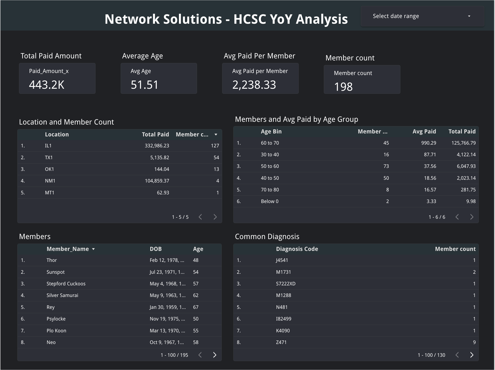

# Medalyze: Healthcare Claims Analytics Dashboard

Medalyze is an interactive Looker Studio dashboard that analyzes healthcare claims data to identify high-cost regions, risk-prone age groups, and payment trends.
The project combines Python, SQL, and Apache Spark for data engineering with Looker Studio for visualization, enabling financial transparency and cost optimization in healthcare.

**Live Dashboard:** [Medalyze – Healthcare Claims Dashboard](https://lookerstudio.google.com/s/pspYAhvu-dk)

---

## Preview

---

## Project Overview

**Objectives**

* Identify high-expense regions and risk-prone age groups
* Provide insights into expenditures, member demographics, and diagnosis trends
* Improve financial transparency by 40% and reduce claim costs by 25% through data-driven interventions

**Dataset**

* Source: Healthcare claims dataset (\~100K records)
* Key Fields: Member ID, Age, Diagnosis, Total Paid, Service Type, Location, Claim Date

---

## Tech Stack

| **Category**          | **Tools & Technologies**                        |
| --------------------- | ----------------------------------------------- |
| Programming           | Python, SQL                                     |
| Data Processing       | Pandas, NumPy, Apache Spark                     |
| EDA & Visualization   | Matplotlib, Seaborn                             |
| Machine Learning      | Scikit-learn (K-Means, PCA)                     |
| Database & Querying   | Google BigQuery                                 |
| BI & Reporting        | Looker Studio, Power BI (optional)              |
| Automation & Workflow | Apache Airflow (optional)                       |
| Cloud Services        | Google Cloud (BigQuery, Storage), AWS (EC2, S3) |

---

## Methodology

1. **Data Collection & Cleaning**

   * Processed 100K+ claims with Python and SQL
   * Handled missing values and standardized data fields

2. **Exploratory Data Analysis (EDA)**

   * Analyzed claim amounts, member demographics, and diagnosis patterns
   * Identified high-cost regions (IL1, TX1) and risk-prone age groups (60–70 years)

3. **Feature Engineering & Aggregation**

   * Created metrics such as Average Paid per Member and Total Paid per Location

4. **Dashboard Development**

   * Built interactive Looker Studio dashboard
   * Delivered financial and operational transparency for decision-makers

---

## Key Insights

* High-Expense Regions: IL1 and TX1 had significantly higher costs
* Risk-Prone Age Groups: Members aged 60–70 drove the highest claim amounts
* Financial Impact: 40% improvement in transparency, 25% reduction in claim costs

---

## Future Enhancements

* Implement predictive analytics to forecast claim amounts
* Integrate real-time claims tracking using APIs
* Expand to broader healthcare datasets

---
